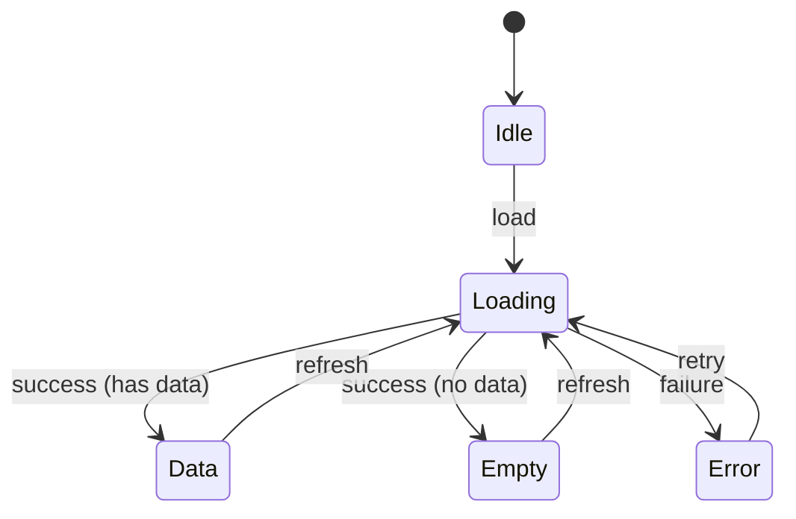

# SPEC Section Detailed Guide

## PATH CONTRACT (MANDATORY)

> **BINDING**: All path examples in this document use dynamic placeholders.
> The AI must resolve paths from `project-config.json` when generating SPECs.

| Placeholder | Resolution Source | Default |
|-------------|-------------------|---------|
| `{FEATURES_DIR}` | project-config.paths.features | `src/features` |
| `{TESTS_DIR}` | project-config.paths.tests_unit | `tests/unit` |
| `{DOCS_DIR}` | project-config.paths.docs_features | `docs/features` |
| `{COMPONENT_EXT}` | project-config.conventions.component_extension | `.tsx` |

**FORBIDDEN**: Never use literal `src/features/` when generating SPECs. Always use `{FEATURES_DIR}/`.

---

> SPEC authoring guide optimized for the target project's Feature-First + Simplified Clean Architecture (reference framework/language in project-config.json).
>
> Unnecessary abstractions (DDD/CQRS/event sourcing, etc.) are excluded, tailored directly to project technology stacks.

---

## Core Principle: Zero-Context AI Implementability

> **Goal**: AI should be able to begin implementation solely from the SPEC document (minimizing codebase search).

Every section in this guide is designed so you can answer "Yes" to the following:

- Can the AI determine where to create files without guesswork?
- Can the AI follow naming conventions without guesswork?
- Can the AI accurately understand domain terminology?
- Can the AI implement data schemas without guesswork?
- Can the AI pinpoint API request/response formats accurately?
- Can the AI clearly understand error handling strategies?
- Can the AI satisfy performance and security requirements?
- Can the AI understand business logic via pseudocode?
- Can the AI reuse test fixtures directly?
- Can the AI generate message keys following established rules?

---

## Characteristic-Based SPEC Depth Modulation

> **Problem**: Full SPEC v3.0 has high authoring overhead due to extensive section depth.
> **Solution**: Apply differentiated mandatory depth based on characteristics in CONTEXT.json.

### Depth Decision Criteria

| Depth | Condition (Any True) |
|---|---|
| **Full** (formerly Tier 1) | `security_sensitive`, `payment_billing`, `pii_handling` |
| **Standard** (formerly Tier 2) | `involves_external_api`, `multi_screen`, `db_schema_change` |
| **Lite** (formerly Tier 3) | None of the above |

### Mandatory Sections by Depth (v3.6 Streamlined)

| Section | Full | Standard | Lite |
| --- | :---: | :---: | :---: |
| **§0.0 Project Context** | ✅ Detailed | ✅ Concise | 📝 1 line |
| §0.1 Target Files | ✅ Detailed | ✅ Detailed | ✅ Concise |
| **§0.2.1 Core State** | ✅ Full Table | ✅ Full Table | ✅ Concise |
| **§0.2.2 Architecture Guidance** | ✅ Criteria + Examples | ✅ Criteria Only | 📝 "Single Hook" |
| **§0.2.3 State Transitions** | ✅ Transition Table | ✅ Transition Table | 📝 Text |
| §0.3 Error Handling | ✅ Full | ✅ Table | 📝 Text |
| §0.4.1 Zod Schema | ✅ Full | ✅ Full | 📝 or N/A |
| §0.4.2 DB Schema | ✅ Full | ✅ Full | 📝 or N/A |
| **§0.5 API Contract** | ✅ Full | ✅ Full | 📝 or N/A |
| **§0.6 NFR** | ✅ Detailed | ✅ Standard Values | 📝 "Standard CRUD" |
| §0.7 AI Logic & Prompts | ✅ (If AI) | ✅ (If AI) | N/A Permitted |
| §0.8 Safety & Guardrails | ✅ (If AI) | ✅ (If AI) | N/A Permitted |
| **§0.9 Design Tokens** | ✅ Detailed | ✅ Concise | 📝 "Use existing" |
| §1 Overview | ✅ | ✅ | ✅ |
| **§1.5 Screen Flow** | ✅ Diagram | ✅ Table | 📝 Text |
| §2 Functional Requirements | ✅ BDD 5-col | ✅ BDD 5-col | ✅ BDD Concise |
| **§2.X Business Rules** | ✅ Pseudocode | ✅ Text | 📝 Concise |
| §3 Dependencies / Risks | ✅ Top 3 | ✅ Top 3 | 📝 1 line |
| §4 Screen Documents | ✅ Detailed | ✅ Concise | 📝 Optional |
| **§5 Verification & Testing** | ✅ Scenario List | ✅ Concise | 📝 Optional |
| **§6 Message Definitions** | ✅ Detailed | ✅ Concise | 📝 Key list only |
| §7 Revision History | ✅ | ✅ | ✅ |

**Legend**: ✅ Mandatory, 📝 Concise / text allowed

### SPEC-Lite Example

```markdown
# 029: Data Input UI Improvement

> **Status**: In Progress (30%) | **Priority**: P2 | **Last Modified**: 2026-02-11
> **SPEC Version**: v3.5 Lite

---

## 0. AI Implementation Contract

### 0.0 Project Context

Extends existing data-input module; no new files created.

### 0.1 Target Files

| Layer | Scope (Glob) | Action | Condition |
| --- | --- | :---: | --- |
| UI | `{FEATURES_DIR}/data-input/components/**` | 🔄 | - |

### 0.2 State & Architecture

Reuses existing `useDataInput` Hook; modifies UI layer only (retains single Hook).

### 0.3 Error Handling

Retains existing patterns.

### 0.4-0.8

**N/A** - Reuses existing implementation.

### 0.9 Design Tokens

Uses existing theme.

---

## 1. Overview

Goal: Enhance readability of data input area (add formatting support).

---

## 2. Functional Requirements

### FR-02901: Formatting Support

| AC | Given | When | Then | Observation Point |
| :-: | --- | --- | --- | --- |
| AC1 | In data input state | Change formatting type | Apply corresponding formatting | `format === 'structured'` |

---

## 6. i18n

- `code_input_language_label`: "Language"
- `code_input_language_typescript`: "TypeScript"

---

## 7. Revision History

| Date | Version | Changes |
| --- | --- | --- |
| 2026-02-11 | v1.0 | Initial draft |
```

### When to Use SPEC-Lite?

| Situation | Recommendation |
| --- | --- |
| New feature containing APIs | **Full SPEC v3.5** |
| Extending existing feature / modifying API | **Standard** |
| UI tweak / minor bug fix | **SPEC-Lite** Permitted |

> **Caution**: Underestimating depth degrades AI implementation quality. When in doubt, select **higher depth**.

---

## Section 0: AI Implementation Contract (Mandatory)

> **Purpose**: Provide core information AI needs before starting implementation at a glance
> **Principle**: Even for information extractable from code, summarizing in SPEC saves AI context gathering costs

---

### 0.0 Project Context

> **Purpose**: Allow AI to determine naming and domain terms without guesswork
> **File Placement**: AI autonomously decides referencing existing codebase patterns

#### 0.0.1 Naming Conventions

```markdown
#### 0.0.1 Naming Conventions

| Target | Pattern | Example |
| --- | --- | --- |
| Custom Hook | `use{Feature}` | `useDataInput` |
| State Type | `{Feature}State` | `DataInputState` |
| Type Definition | `{Entity}` or `{Entity}Type` | `DataSubmission` |
| Event | `on{Action}` | `onSubmitData`, `onProcess` |
| Message Key | `{screen}_{element}_{state}` | `data_input_submit_button_label` |
| Component | `{Feature}{Role}` (PascalCase) | `DataInputPanel`, `ReportOption` |
| API Route | `/api/{feature}/{action}` | `{SOURCE_ROOT}/api/{feature}/{action}` (framework-specific) |
```

**Authoring Principles**:

- Must match existing codebase conventions
- Include concrete examples so AI does not guess names

#### 0.0.2 Glossary

```markdown
#### 0.0.2 Glossary

> **Reference**: [docs/glossary.md](../glossary.md) - Project-wide glossary
> Consult glossary.md for domain terms used in this feature

**Core Terminology for this Feature**:

| Term | Definition | Code Representation |
| --- | --- | --- |
| {Term1} | {Definition} | `{TypeName}` |
| {Term2} | {Definition} | `{fieldName}` |

> ℹ️ If new terms are needed, register in glossary.md first before referencing
```

**Authoring Principles**:

- **SSOT**: `docs/glossary.md` is the single source of truth
- In SPEC, excerpt only key terms used in this feature
- Register new terms in glossary.md first

---

### 0.1 Target Files (Scope-Based)

> **v3.1 Change**: Uses **Glob patterns** instead of exhaustive concrete paths
> **SSOT**: CONTEXT.json `references.related_code` maintains actual file lists

```markdown
| Layer | Scope (Glob) | Action | Condition | Notes |
| --- | --- | :---: | --- | --- |
| Type Defs | `{FEATURES_DIR}/code-input/types/**` | 🆕 | - | Zod schema + TypeScript types |
| Hook | `{FEATURES_DIR}/code-input/hooks/**` | 🆕 | - | Custom Hook (State management) |
| API | `{FEATURES_DIR}/code-input/api/**` | 🆕 | - | API invocations |
| UI | `{FEATURES_DIR}/code-input/components/**` | 🆕 | - | React components |
| Test | `tests/unit/features/code-input/**` | 🆕 | - | Unit tests |
| API Route | `{SOURCE_ROOT}/api/{feature}/**` (framework-specific) | 🆕 | If AI analysis selected | Conditional |
```

**Action Types**:
| Icon | Meaning |
|:---:|---|
| 🆕 | New file creation |
| 🔄 | Modify existing file |
| ⚡ | Conditional (see Condition column) |

**Authoring Principles**:

- Specify scope via Glob patterns (`**`, `*`)
- For **conditional files**, state trigger condition in Condition column
- Detailed file list is referenced from CONTEXT.json `references.related_code`
- Updating CONTEXT.json post-implementation is critical for maintaining SSOT

**Example: Handling Conditional Files**:

```markdown
| Layer | Scope | Action | Condition | Notes |
| --- | --- | :---: | --- | --- |
| API Route | `{SOURCE_ROOT}/api/{feature}/**` (framework-specific) | ⚡ | If Option A selected | Server-side analysis |
| Client | `{FEATURES_DIR}/code-input/lib/**` | ⚡ | If Option B selected | Local processing |
```

→ If user selects Option A, implement only API Route.

#### §0.1 ↔ §0.4 Cross-Reference Validation

> **Purpose**: Ensure items defined in Data Schema (§0.4) are reflected in Target Files (§0.1) without omissions
> **Verification Phase**: Phase 4 validation stage after completing SPEC authoring

| Defined in §0.4 | Required in §0.1 | Validation Rule |
| --- | --- | --- |
| §0.4.1 New Zod Schema | `Type Definitions` Layer | File path mandatory when schema is defined |
| §0.5 New API Route | `API Route` Layer | Route directory mandatory when endpoint is defined |

**Omission Prevention Checklist**:

- [ ] Defined new schema like `AnalysisResultSchema` in §0.4.1 → Add `{FEATURES_DIR}/{domain}/types/{schema}.ts` to §0.1
- [ ] Defined new API Route in §0.5 → Add `{SOURCE_ROOT}/api/{name}/` (framework-specific) to §0.1

**Common Anti-Patterns**:

```markdown
❌ Incorrect (Missing Type Definitions layer):
| Layer | Scope | Action |
| --- | --- | :---: |
| Hook | `{FEATURES_DIR}/analysis/hooks/**` | 🆕 | ← Only Hook listed
| UI | `{FEATURES_DIR}/analysis/components/**` | 🆕 | ← Missing Type Definitions layer!

If AnalysisResultSchema is defined in §0.4.1 → Type Definitions layer is mandatory!

✅ Correct:
| Layer | Scope | Action |
| --- | --- | :---: |
| Type Defs | `{FEATURES_DIR}/analysis/types/**` | 🆕 | ← Added
| Hook | `{FEATURES_DIR}/analysis/hooks/**` | 🆕 |
| UI | `{FEATURES_DIR}/analysis/components/**` | 🆕 |
```

---

### 0.2 State & Architecture

> **v3.5 Update**: Shifted from prescriptive provider lists to **principle-based guidelines**
> **Purpose**: Allow AI to design autonomously according to feature complexity while following consistent patterns

---

#### 0.2.1 Core State (Mandatory)

> **Purpose**: Define **core state elements** AI must manage
> **Principle**: Specify state structure explicitly, but let AI determine file separation based on SRP

```markdown
#### 0.2.1 Core State

##### State Element Definitions

| State Element | Type | Required | Purpose | Initial Value |
| --- | --- | :---: | --- | --- |
| `items` | `CodeSubmission[]` | ✅ | Data list | `[]` |
| `status` | `ScreenStatus` | ✅ | Screen status (idle/loading/data/empty/error) | `'idle'` |
| `error` | `AppError \| null` | ⚪ | Error info | `null` |
| `filter` | `CodeFilter \| null` | ⚪ | Filter condition | `null` |

##### State Enum Definitions (Recommended)

```typescript
type ScreenStatus = 'idle' | 'loading' | 'data' | 'empty' | 'error';
```

##### Derived State

| Derived State | Calculation | Purpose |
| --- | --- | --- |
| `hasData` | `status === 'data' && items.length > 0` | Data presentation condition |
| `filteredItems` | `filter ? applyFilter(items, filter) : items` | Filtered list |
| `itemCount` | `filteredItems.length` | UI display |
```

**Core State Authoring Principles**:
- Define **core state elements** only (not low-level implementation trivia)
- Implement derived state via Hook `useMemo`
- State **initial values** explicitly so AI can utilize them when authoring tests

---

#### 0.2.2 Architecture Guidance

> **Purpose**: Guide AI to separate files autonomously following **SRP (Single Responsibility Principle)**
> **Core**: Provide **separation criteria** and **naming conventions** instead of rigid file lists

```markdown
#### 0.2.2 Architecture Guidance

##### Hook Separation Criteria (SRP Principle)

| Condition | Recommended Action | Example |
| --- | --- | --- |
| Single screen, simple CRUD | Single Hook | `useCodeInput` |
| 2+ screens (list/detail) | Per-screen Hook separation | `useCodeList`, `useCodeDetail` |
| Complex form validation | Separate Form Hook | `useCodeForm` |
| State shared across multiple screens | Context + Hook | `CodeInputProvider` + `useCodeInputContext` |

##### API Separation Criteria

| Condition | Recommended Action | Example |
| --- | --- | --- |
| Simple API call | Single API function | `processData()` |
| External API integration (AI, etc.) | Separate per external API | `processData()`, `generateReport()` |
| Complex business logic | Domain service separation | `analysisService` |

##### Naming Conventions (Mandatory)

| Target | Pattern | Example |
| --- | --- | --- |
| **Hook (List)** | `use{Feature}List` | `useCodeList` |
| **Hook (Detail)** | `use{Feature}Detail` | `useCodeDetail` |
| **Hook (Form)** | `use{Feature}Form` | `useCodeForm` |
| **Hook (Single)** | `use{Feature}` | `useCodeInput` |
| **API Function** | `{action}{Feature}` | `processData`, `fetchDetail` |
| **Type Definition** | `{Feature}State` | `CodeInputState` |
| **Component** | `{Feature}{Role}` | `CodeInputPanel`, `CodeInputForm` |

##### React Lifecycle Guidelines

| Situation | Pattern | Rationale |
| --- | --- | --- |
| Per-screen state (Default) | `useState` / `useReducer` | Memory efficiency, garbage collected on unmount |
| Global app state (Theme, etc.) | `Context` + `useContext` | Persists throughout app session |
| Server state (API data) | `fetch` + `useState` / SWR | Cache management |
| Expensive calculations | `useMemo` | Prevent recomputation |

##### AI Design Decision Flow

1. Analyze FR (Functional Requirements)
   ↓
2. Identify screen count (Reference Screen Flow)
   ↓
3. Determine Hook separation need
   ├── Single screen + simple → Single Hook
   └── 2+ screens or complex → Separate
   ↓
4. Determine API separation need
   ├── Simple API → Single function
   └── External API / complex logic → Separate
   ↓
5. Apply naming conventions
   ↓
6. Determine lifecycle strategy (useState / useContext / useMemo)
```

**Architecture Guidance Authoring Principles**:
- Clarify **separation criteria** so AI can make consistent design choices
- **Naming conventions** must be strictly followed (guarantees consistency)
- **"Examples" section is optional** — add only for complex features
- Application across depths:
  - Lite (simple): Reference separation criteria only; mostly single Hook
  - Full / Standard (complex): Separation criteria + concrete examples recommended

##### §0.2.2 Authoring Guide by Depth

| Item | Full | Standard | Lite |
| --- | :---: | :---: | :---: |
| Core State | ✅ Full Table | ✅ Full Table | ✅ Concise Table |
| Separation Criteria | ✅ + Concrete Examples | ✅ Criteria Only | 📝 "Single Hook" |
| Naming Rules | ✅ Full | ✅ Full | ✅ Full |
| Lifecycle | ✅ Detailed | ✅ Basic | 📝 "useState default" |

---

### 0.2.3 State Transitions (Streamlined)

> **Purpose**: Provide essential information so AI understands state transitions accurately

```markdown
#### 0.2.3 State Transitions

##### State List

| State | Description |
| --- | --- |
| `idle` | Initial state |
| `loading` | Data loading in progress |
| `data` | Data rendered |
| `empty` | No data |
| `error` | Error occurred |

##### Transition Table

| From | Event | To | Notes |
| --- | --- | --- | --- |
| `idle` | `load` | `loading` | Upon entering screen |
| `loading` | `success (has data)` | `data` | - |
| `loading` | `success (no data)` | `empty` | - |
| `loading` | `failure` | `error` | Error logged |
| `data` | `refresh` | `loading` | - |
| `error` | `retry` | `loading` | Max 3 retries |

##### State Diagram (Mermaid)


```

**Authoring Principles**:
- State list and transition table are mandatory
- Add Mermaid diagram only when transitions are complex
- AI references existing codebase for code implementation patterns

---

### 0.3 Error Handling Policy

#### 0.3.1 Error Classification

```markdown
| Error Type | Code Range | Retryable | Logging Required |
| --- | --- | :---: | :---: |
| Validation | `VALIDATION_*` | ❌ | ❌ |
| Network | `NETWORK_*` | ✅ | ✅ |
| Auth | `AUTH_*` | Conditional | ✅ |
| Business | `BIZ_*` | ❌ | ⭕ |
| System | `SYSTEM_*` | ✅ | ✅ |
```

#### 0.3.2 User-Facing Messages

```markdown
| Error Code | User Message | Message Key |
| --- | --- | --- |
| `NETWORK_OFFLINE` | "Please check your network connection" | `error_network_offline` |
| `VALIDATION_REQUIRED` | "Please enter {field}" | `error_validation_required` |
| `AUTH_EXPIRED` | "Please log in again" | `error_auth_expired` |
```

#### 0.3.3 Recovery Actions

```markdown
| Error Type | Auto Recovery | User Action | UI Presentation |
| --- | :---: | --- | --- |
| Network | 3 retries | Retry button | Toast + Retry |
| Auth | Attempt token refresh | Re-login | Dialog |
| Validation | - | Correct field | Inline error |
| Business | - | Review notice | Dialog |
```

#### 0.3.4 Logging Requirements

```markdown
| Error Type | Log Level | Included Info | Sampling |
| --- | --- | --- | --- |
| Network | WARN | `url`, `status`, `duration` | 100% |
| Auth | ERROR | `user_id`, `action`, `reason` | 100% |
| Business | INFO | `action`, `params` | 10% |
| System | ERROR | `stack_trace`, `context` | 100% |
```

**Fail-Fast Principles**:

- Validate invalid input immediately and fail fast
- Silent failures are prohibited (no `catch (e) {}`)
- Record all unexpected errors via logger

---

### 0.4 Data Schema & Security (Mandatory)

> **SSOT**: `{FEATURES_DIR}/{feature}/types/` is the source of truth; SPEC provides summary + intent documentation

#### 0.4.1 Zod Schema (Frontend Side)

```markdown
| Schema | Fields / Types | nullable | Notes |
| --- | --- | :---: | --- |
| `CodeSubmissionSchema` | `id: z.string()` | ❌ | UUID |
| | `code: z.string()` | ❌ | Submitted code |
| | `language: z.string()` | ❌ | Programming language |
| | `errorMessage: z.string().optional()` | ⭕ | Error message |
| | `goal: z.string().optional()` | ⭕ | Learning goal |
| | `createdAt: z.string().datetime()` | ❌ | |
```

**Zod Schema Rules**:

- Define schema via `z.object()`
- Derive TypeScript types using `z.infer<typeof Schema>`
- Validation error messages should be localized

##### 0.4.1.1 Model Invariants

> **Purpose**: Define rules that must never be broken at the model level
> **Validation Points**: Zod parse, factory functions, state updates

```markdown
#### Model Invariants

| Model | INV-ID | Invariant Condition | Validation Method | On Violation |
| --- | :---: | --- | --- | --- |
| `CodeSubmission` | M-INV-01 | `code` cannot be empty string | `z.string().min(1)` | `ZodError` |
| `CodeSubmission` | M-INV-02 | `language` must be supported language | `z.enum([...])` | `ZodError` |
| `ReportFilter` | M-INV-03 | `selectedIndex` >= 0 | `z.number().nonnegative()` | `ZodError` |

**Invariant Implementation Pattern**:

```typescript
import { z } from 'zod';

/** Code submission schema - Enforces invariants via Zod */
export const CodeSubmissionSchema = z.object({
  id: z.string().uuid(),
  // M-INV-01: code cannot be empty string
  code: z.string().min(1, 'Please enter code'),
  // M-INV-02: language must be supported language
  language: z.enum(['typescript', 'javascript', 'python', 'java']),
  errorMessage: z.string().optional(),
  goal: z.string().optional(),
  createdAt: z.string().datetime(),
  );

export type CodeSubmission = z.infer<typeof CodeSubmissionSchema>;
```
```

**Model Invariants Authoring Principles**:
- Document all **core business constraints** as invariants
- Specify behavior upon validation failure (Exception vs. auto-correction)
- **Validate via Zod schema** (runtime guarantee)

---

### 0.5 API Contract (Mandatory) - Hybrid v3.1

> **v3.1 Update**: Introduced hybrid format (Schema Table + Example JSON)
> **SSOT Principle**: Code `route.ts` > Schema Table > Example JSON
> **Validation**: `spec-validator` verifies Schema ↔ Example alignment

#### API Usage Determination

| Situation | Handling |
| --- | --- |
| **No** API Route | Explicitly state `§0.5: N/A - Client-side processing only` |
| **1-2** Endpoints | Author in §0.5 using hybrid format |
| **3+** Endpoints or **100+** lines | Separate into standalone `API-{NNN}.md` |

#### §0.5 Hybrid Format

```markdown
### 0.5 API Contract

> **SSOT**: API routes in `{SOURCE_ROOT}` (framework-specific)

#### Endpoint List

| ID | Method | Path | Auth | Idempotent | Description |
| --- | --- | --- | :---: | :---: | --- |
| API-001-01 | POST | `{SOURCE_ROOT}/api/{feature}/process` | ❌ | ❌ | Process data |

#### API-001-01: process

##### Request Schema (SSOT)

| Field | Type | Required | Constraints | Description | Example |
| --- | --- | :---: | --- | --- | --- |
| `data` | string | ✅ | minLength: 1, maxLength: 10000 | Target data to process | `"{ "name": "test" }"` |
| `category` | string | ✅ | enum: defined per project | Category | `"report"` |
| `errorMessage` | string | ⚪ | maxLength: 2000 | Error message | `"TypeError..."` |
| `goal` | string | ⚪ | maxLength: 500 | Processing goal | `"Normalize data"` |

##### Request Example

```json
{
  "data": "{ "name": "test", "value": 42 }",
  "category": "report",
  "goal": "Normalize data"
}
```

##### Response Schema (SSOT)

| Field | Type | Required | Constraints | Description | Example |
| --- | --- | :---: | --- | --- | --- |
| `status` | string | ✅ | enum: `ok`, `error` | Processing result | `"ok"` |
| `data` | object | ⚪ | - | Result on success | `{}` |
| `data.summary` | string | ⚪ | - | Processing summary | `"Normalization complete..."` |
| `data.comparison` | object | ⚪ | - | Change diff | `{}` |
| `error` | object | ⚪ | When status=error | Error info | `{}` |
| `error.code` | string | ⚪ | UPPER_SNAKE_CASE | Error code | `"INVALID_INPUT"` |
| `error.message` | string | ⚪ | - | Error message | `"Data is required"` |

##### Success Response Example (200 OK)

```json
{
  "status": "ok",
  "data": {
    "summary": "Input data normalized successfully...",
    "comparison": {
      "before": "{ "name": "test", "value": 42 }",
      "after": "{ "name": "test", "value": 42, "normalized": true }"
    }
  }
}
```

##### Error Codes

| HTTP | Code | Condition | User Message | Client Action |
| :---: | --- | --- | --- | --- |
| 400 | `INVALID_INPUT` | Missing required field | "Please check your input" | Inline error display |
| 429 | `RATE_LIMITED` | Too many requests | "Please retry shortly" | Exponential backoff retry |
| 500 | `INTERNAL_ERROR` | Server error | "An error occurred" | Retry (max 2 times) |
```

#### Hybrid Format Authoring Principles

| Element | Required | Role | Verification |
| --- | :---: | --- | --- |
| **Schema Table** | ✅ | Type / constraint definitions (SSOT) | spec-validator |
| **Request Example** | ✅ | Concrete request payload | Cross-check against Schema |
| **Response Example** | ✅ | Concrete response payload | Cross-check against Schema |
| **Error Codes Table** | ✅ | Error catalog + handling | - |
| **Error Examples** | ✅ | Concrete error response payload | Cross-check against Error Codes |

---

### 0.6 NFR (Non-Functional Requirements) - Mandatory

> **Purpose**: Present clear targets so AI meets quality criteria

```markdown
### 0.6 NFR (Non-Functional Requirements)

#### Performance

| Metric | Target | Measurement Method |
| --- | --- | --- |
| **Initial Response Time** | < 500ms | API call start → first byte received |
| **Total Response Time** | < 2s (P95) | API call start → completion |
| **Streaming Start** | < 1s | (Streaming APIs only) First chunk received |

#### Concurrency

| Item | Estimated Value | Notes |
| --- | --- | --- |
| **Concurrent Users** | ~100 | MVP baseline |
| **Request Frequency per User** | 1 req / 10s | Average |
| **Peak Multiplier** | 3x | 300 concurrent requests during peak |

#### Reliability

| Item | Policy | Notes |
| --- | --- | --- |
| **Retries** | Max 2 retries, exponential backoff | Network / 5xx only |
| **Timeout** | 30s | Client side |

#### Cost - AI Features Only

| Item | Ceiling | Notes |
| --- | --- | --- |
| **LLM Calls** | 10 calls / user / day | Free tier |
| **Token Ceiling** | 2K in, 1K out | Per request |
| **Monthly Budget Ceiling** | $100 | Total across all users |

#### Observability

| Item | Content |
| --- | --- |
| **Log Fields** | `user_id`, `action`, `duration_ms`, `status` |
| **Metrics** | `analysis_total`, `analysis_duration_seconds` |
| **Alert Conditions** | Error rate > 5% (over 5 mins), P95 > 3s |
```

**NFR Authoring Principles**:

- All figures must be **measurable**
- AI features must specify a **cost ceiling**
- Non-applicable items must be explicitly marked "N/A" (no empty sections)

---

### 0.7 AI Logic & Prompts (Mandatory for AI Features)

> **Purpose**: Enable AI to reproduce prompts and behaviors accurately when implementing AI features

```markdown
### 0.7 AI Logic & Prompts

> ⚠️ **Mandatory for AI Features** - Mark "N/A" if feature does not use LLMs/GenAI

#### 0.7.1 AI Role Definitions

| Role | Responsibility | Model Used | Token Ceiling |
| --- | --- | --- | --- |
| **Analyzer** | Analyze data, extract issues | LLM API | Input 2K, Output 1K |
| **Explainer** | Generate detailed analysis | LLM API | Input 2K, Output 2K |
| **ReportMaker** | Generate summary report | LLM API | Input 1K, Output 512 |

#### 0.7.2 System Prompt Template

> SSOT: `{SOURCE_ROOT}/config/ai-config.ts` or inside API Route (per project AI service)

**Analyzer Prompt**:
```
You are a programming education assistant.
Analyze the submitted code and provide educational feedback.

## Context

- Language: {{language}}
- User Goal: {{goal}}
- Error (if any): {{errorMessage}}

## Analysis Rules

1. Identify key concepts demonstrated in the code
2. Find potential improvements with educational explanations
3. If there's an error, explain why it occurs and how to fix it

## Output Format (JSON only)

{ "concepts": [...], "improvements": [...], "errorAnalysis": {...} }
```

#### 0.7.3 Response Schema (Structured Output)

> **Mandatory**: Enforce via LLM response schema validation; free-form text responses prohibited

**Analyzer Response**:
```json
{
  "type": "object",
  "required": ["concepts", "improvements"],
  "properties": {
    "concepts": { "type": "array", "items": { "type": "string" } },
    "improvements": { "type": "array", "items": { "type": "object" } },
    "errorAnalysis": { "type": "object" }
  }
}
```

#### 0.7.4 Prompt Variable Injection

| Variable | Source | Type | Required |
| --- | --- | --- | :---: |
| `{{language}}` | Request body | string | ✅ |
| `{{goal}}` | Request body | string | ⚪ |
| `{{errorMessage}}` | Request body | string | ⚪ |
```

**AI Logic Authoring Principles**:
- Document the **exact, full text** of System Prompts (no summarizing)
- Unify variable placeholders using `{{variable}}` format
- Response Schema must **match real schema** exactly
- Token ceilings provide basis for cost calculations

---

### 0.8 Safety & Guardrails (Mandatory for AI Features)

> **Purpose**: Guarantee safety, consistency, and quality of AI outputs

```markdown
### 0.8 Safety & Guardrails

> ⚠️ **Mandatory for AI Features** - Mark "N/A" if feature does not use LLMs/GenAI

#### 0.8.1 Input Validation

| Validation Item | Rule | On Failure |
| --- | --- | --- |
| Input Length | max 10000 chars (code) | 400 Bad Request + notify client |
| Blocklist Filter | Malicious code detection | Reject input + warning message |
| Injection Defense | Sanitize prompt injection | Auto-escape |

#### 0.8.2 Output Validation

| Validation Item | Rule | On Failure |
| --- | --- | --- |
| JSON Parsing | Conforms to responseSchema | 1 retry → fallback response |
| Response Length | max 5000 chars | Auto-truncate |

#### 0.8.3 Rate Limiting

| Limit Item | Free Tier | On Exceed |
| --- | --- | --- |
| AI calls / min | 5 calls | 429 + show cooldown timer |
| AI calls / day | 50 calls | Daily ceiling notification |

#### 0.8.4 Fallback Strategy

| Failure Type | Fallback | User Message |
| --- | --- | --- |
| LLM Timeout (>30s) | Use predefined fallback | "Please try again shortly" |
| JSON Parse Failure | Fallback response after 1 retry | (Handled transparently) |
| Rate Limit Exceeded | Reject | "Too many requests. Please retry in {{seconds}}s" |
```

**Safety Authoring Principles**:

- **Mandatory for all AI features** (mark "N/A" if not applicable)
- Fallbacks must include **concrete user messages** tailored for UX
- Rate limits must be explicitly specified

---

### 0.9 Design Tokens

> **Purpose**: Ensure AI uses theme system without hardcoded styling
> **SSOT**: Root `DESIGN.md` YAML design tokens + Markdown rationale. Framework global style files and `docs/design/tokens/` are derived artifacts.

```markdown
### 0.9 Design Tokens

> **Reference**: `DESIGN.md` and `docs/design/tokens/design-tokens.css`

#### 0.9.1 Color Tokens

| Purpose | Token | Usage Context |
| --- | --- | --- |
| Primary Action | `text-primary` / `bg-primary` | CTA buttons, highlighted text |
| Error State | `text-destructive` | Error messages, validation failure |
| Surface | `bg-card` | Card background |
| On Surface | `text-card-foreground` | Text on cards |
| Muted | `text-muted-foreground` | Secondary helper text |

**Prohibited Patterns**:

- ❌ `text-red-500` → ✅ `text-destructive`
- ❌ `bg-[#1e3a8a]` → ✅ `bg-card`
- ❌ `text-white` → ✅ `text-foreground`

#### 0.9.2 Typography Tokens

| Purpose | Tailwind Classes | Usage Context |
| --- | --- | --- |
| Page Title | `text-2xl font-semibold font-sans` | Header title |
| Section Header | `text-lg font-semibold font-sans` | Section header |
| Body Text | `text-sm font-normal font-sans` | Body text |
| Code Text | `text-sm font-mono` | Code snippet |

#### 0.9.3 Spacing Tokens

| Purpose | Value | Usage Context |
| --- | --- | --- |
| Card Padding | `p-4` (16px) | Card inner padding |
| List Item Gap | `gap-2` (8px) | List item spacing |
| Section Gap | `gap-6` (24px) | Inter-section spacing |

#### 0.9.4 Common Components

| Component | Path | Purpose |
| --- | --- | --- |
| `LoadingSpinner` | `src/shared/components/common/` | Loading state indicator |
| `AppHeader` | `src/shared/components/layout/` | Header |
| Glass Panel | Tailwind class: `backdrop-blur-xl bg-white/5 border border-white/10 rounded-xl` | Standard panel |
```

**Design Token Authoring Principles**:

- **Hardcoded colors/fonts prohibited** — Must use CSS variables / Tailwind tokens
- Prioritize reusing existing shared components
- Register new tokens in design system first if needed

#### 0.9.5 UI Interaction Rules Reference

```markdown
#### 0.9.5 UI Interaction Rules

> **Common Rules Reference**: CLAUDE.md Design System - Interaction Section
>
> - Hover / click response: 150ms (micro)
> - Toggle / dropdown: 250ms (small)
> - Modal / panel transition: 400ms (medium)
> - Easing: `cubic-bezier(0.16, 1, 0.3, 1)`

**Exceptions / Special Rules for this Feature**:

| Item | Common Rule | Feature Exception | Rationale |
| --- | --- | --- | --- |
| Loading | Spinner display | AI responses stream incrementally | Long wait times |
| Feedback | Toast 3s | Analysis completion switches Panel | Complex result display |

**When no exceptions exist**: Explicitly state "Full compliance with common rules"
```

---

## Section 1: Overview (Mandatory)

### 1.1 Goal (WHY)

```markdown
### Goal (WHY)

{1-2 sentences capturing business rationale and user value}

Example: "Provide structured insights on user-submitted data using AI, improving task efficiency by 30%."
```

**Authoring Principles**:

- Summarize Why & Success Criteria from CONTEXT.json
- Include measurable targets where feasible

### 1.2 User Story

```markdown
### User Story

AS A user
I WANT TO receive structured analysis on my submitted data
SO THAT I can understand causes of errors and ways to improve
```

### 1.3 MVP Scope

```markdown
### MVP Scope

| In Scope | Out of Scope |
| --- | --- |
| Data processing & analysis | Real-time collaboration |
| Comparison diff display | Auto-correction |
| Summary report | Advanced analysis path recommendations |
```

### 1.4 Goals / Non-Goals (Mandatory)

```markdown
### Goals (What this SPEC will achieve)

- [ ] Users can submit data to receive AI analysis
- [ ] Detailed analysis is streamed incrementally
- [ ] Before/After diffs of improvements are displayed

### Non-Goals (What this SPEC explicitly excludes)

> ⚠️ **Important**: Non-Goals are not merely "things to do later", but "things deliberately out of scope"

| Excluded Item | Rationale for Exclusion | Alternative (if any) |
| --- | --- | --- |
| Real-time collaboration | Exceeds MVP scope, adds complexity | Re-evaluate in Phase 2 |
| Auto-correction | Contradicts core learning objective | Replaced by Diff suggestions |
```

### 1.5 Screen Flow

```markdown
### 1.5 Screen Flow

#### Screen Flow Diagram (Full/Standard):
```

[Home Screen]
│
├──[Data Input]──▶ [Processing]
│ │
│ ├──[Complete]──▶ [Detail View]
│ │ │
│ │ ├──[Comparison Tab]──▶ [Comparison View]
│ │ └──[Validation Tab]──▶ [Validation]
│ │
│ └──[Error]──▶ [Error Display + Retry]

```

#### Screen Transition Table:

| From | Action | To | Passed Data |
| --- | --- | --- | --- |
| Home | Complete data input | Processing | `dataSubmission` |
| Processing | Processing complete | Detail | `processingResult` |
| Detail | Click comparison tab | ComparisonView | `comparison` |
| Detail | Click report tab | Report | `reportData` |
```

---

## Section 2: Functional Requirements (Mandatory)

> **Principle**: Each FR must be independently implementable and testable

### FR Template

```markdown
### FR-{NNN}01: {Feature Name}

| Item | Content |
| --- | --- |
| **Description** | {Clear 1-2 sentence description of behavior} |
| **Target File** | `{FEATURES_DIR}/{feature}/components/{name}.tsx` |
| **Test** | `tests/unit/{name}.test.ts` |
| **State Transition** | {e.g. idle → loading → data/error} |
| **Status** | ⬜ Pending |

**Acceptance Criteria (AC)**:

| AC | Given (Precondition) | When (Action) | Then (Expected Result) | Observation Point |
| :-: | --- | --- | --- | --- |
| AC1 | {Precondition} | {Action} | {Expected Result} | {Validation variable/state} |
| AC2 | {Precondition} | {Action} | {Expected Result} | {Validation variable/state} |

**Edge Cases (EC)**:

- EC1: {Exceptional situation} → {Resolution strategy}
- EC2: ...

**Exception Flows (EF)**:

> Explicitly specify **all exceptional paths** outside the happy path

| EF | Trigger Condition | System Reaction | User Message | Recovery Path |
| :-: | --- | --- | --- | --- |
| EF1 | Network offline | Render error | "Please check your network connection" | Show retry button |
| EF2 | API timeout (>30s) | Retry 1 time | "Please try again shortly" | Show retry button |

**AI Implementation Hints**:

```typescript
// Reference pattern: {FEATURES_DIR}/explanation/hooks/use-explanation.ts
// Hook to use: useCodeInput
// State management: useState + useEffect
```
```

**FR Authoring Principles**:
- FR ID combines feature number + sequential index (FR-00101, FR-00102)
- **AC must use BDD 5-column table format** (checkbox ACs prohibited)
- AI hints should reference actual codebase file paths

### BDD AC Authoring Rules

**5-Column Structure**:

| Column | Role | Writing Criteria |
| --- | --- | --- |
| AC | Identifier | Sequential `AC1`, `AC2`, ... |
| Given (Precondition) | Test setUp / Mock target | "When user is in X state", "When Y data exists" |
| When (Action) | Test Act action | "When clicking Z button", "When API is invoked" |
| Then (Expected Result) | Test Assert target | "W is rendered", "State transitions to X" |
| Observation Point | Target for `expect()` matcher | Concrete variable names, state values, UI elements |

**Good Example**:

| AC | Given (Precondition) | When (Action) | Then (Expected Result) | Observation Point |
| :---: | --- | --- | --- | --- |
| AC1 | Data input completed | Click process button | AI processing results are rendered | `status === 'data'`, Detail panel rendered |
| AC2 | Network offline | Execute analysis | Error message is displayed | `status === 'error'`, Toast displayed |

**Anti-Patterns (Prohibited)**:

```markdown
❌ AC lacking Given:
| AC1 | - | Process data | Results rendered | - |

❌ AC with vague Then:
| AC1 | Logged in state | Click | Displayed | - |

❌ Missing Observation Point:
| AC1 | Logged in state | Analysis button | Results displayed | - |

✅ Correct AC:
| AC1 | 3 data items entered, category selected | Click process button | Detail/diff/validation rendered | `status === 'data'`, 3 panels confirmed |
```

---

### 2.X Business Rules / Logic

> **Purpose**: Enable AI to understand complex business logic via pseudocode
> **Location**: Grouped inside individual FRs or under dedicated sections

#### Pseudocode Style Guide

> **Principle**: Write language-agnostic, unambiguous pseudocode

**Keyword Rules**:

| Keyword | Purpose | Example |
| --- | --- | --- |
| `FUNCTION ... END FUNCTION` | Function definition | `FUNCTION calc(x): ... END FUNCTION` |
| `SET` | Variable assignment | `SET rate = 0.01` |
| `IF / ELSE IF / ELSE / END IF` | Conditional branch | `IF x > 0: ... ELSE: ... END IF` |
| `FOR ... END FOR` | Loop | `FOR item IN items: ... END FOR` |
| `WHILE ... END WHILE` | Conditional loop | `WHILE count < 10: ... END WHILE` |
| `THROW Error(code, message)` | Throw exception | `THROW Error("INVALID_INPUT", "...")` |
| `RETURN` | Return value | `RETURN result` |
| `// Comment` | Inline note | `SET rate = 0.01 // default 1%` |

**Built-in Functions**:

| Function | Description | Example |
| --- | --- | --- |
| `FLOOR(x)` | Floor | `FLOOR(3.7)` → 3 |
| `CEIL(x)` | Ceiling | `CEIL(3.2)` → 4 |
| `ROUND(x)` | Round | `ROUND(3.5)` → 4 |
| `MIN(a, b)` / `MAX(a, b)` | Min / Max | `MAX(0, value)` |
| `LEN(list)` | Length | `LEN(items)` |
| `TRIM(str)` | Strip whitespace | `TRIM(input)` |

**Authoring Example - Data Processing Logic**:

```markdown
#### BR-001: Data Processing Flow

**Rule**: Execute processing based on submitted data type and payload.

**Pseudocode**:
```
FUNCTION processData(data, category, errorMessage, goal):
    // Input validation
    IF data IS EMPTY:
        THROW Error("INVALID_INPUT", "Please enter data")
    END IF

    IF LEN(data) > 10000:
        THROW Error("INPUT_TOO_LONG", "Please enter data under 10000 characters")
    END IF

    // Execute AI processing
    SET prompt = buildPrompt(data, category, errorMessage, goal)
    SET result = callAIService(prompt)

    // Result validation
    IF result IS NULL:
        THROW Error("PROCESSING_FAILED", "Processing failed")
    END IF

    RETURN {
        detail: result.detail,
        comparison: result.improvements,
        report: generateReport(result.insights)
    }
END FUNCTION
```

**Truth Table**:
| data | category | Result |
| --- | --- | --- |
| Valid payload | "structured" | Return processed results |
| Empty string | ANY | Error: INVALID_INPUT |
| 10001 chars | ANY | Error: INPUT_TOO_LONG |
```

**Business Rules Authoring Principles**:

- Specify **complex conditional / computational logic** using pseudocode
- Use language-agnostic pseudocode adhering to keyword conventions
- Clarify boundary conditions using **Truth Tables**
- Include **Edge Cases** within Business Rules

---

## Section 3: Dependencies & Risks (Mandatory)

### 3.1 Prerequisites

```markdown
### Prerequisites

| Target Dependency | Required Item | Status | Notes |
| --- | --- | :---: | --- |
| AI Service | API key configuration | ✅ | ai-config.ts |
| SPEC-001 | Data processing module | ⏳ | API Route required |
```

### 3.2 Top 3 Risks

```markdown
### Top 3 Risks

| Risk | Impact | Mitigation |
| --- | :---: | --- |
| Instability of AI response | Medium | Structured Output + validation |
| Response latency | Medium | Streaming + timeout handling |
| API budget overrun | Low | Rate Limiting + daily ceilings |
```

### 3.4 Sequence Diagrams (Mandatory for Full/Standard)

> **Mandatory Condition**: Full/Standard depth features, or when 3 or more components interact

```markdown
### Sequence Diagrams

#### SD-001: Data Processing Flow (Happy Path)
```

User UI/Component Hook API Route AI Service
│ │ │ │ │
│──[1] Input data──────▶│ │ │ │
│ │──[2] submit()──▶│ │ │
│ │ │──[3] POST /api──▶│ │
│ │ │ │──[4] analyze──▶│
│ │ │ │◀─[5] result───│
│ │ │◀─[6] response───│ │
│ │◀─[7] state update│ │ │
│◀─[8] Update UI───────│ │ │ │

```

**Division of Responsibilities**:
| Step | Component | Responsibility |
| :---: | --- | --- |
| 1-2 | UI / Component | Gather user input, invoke Hook |
| 3 | Hook | Execute API call |
| 4-5 | API Route | Integrate with AI |
| 6-8 | Hook → UI | Update state, re-render UI |
```

---

## Section 4: Screen Documents (Conditional)

> Author only when UI modifications are involved

```markdown
### Screen Documents

| Screen ID | Screen Name | Document | Status |
| --- | --- | --- | :---: |
| SCR-001-001 | Data Input Screen | [screens/data-input.md](./screens/data-input.md) | ⬜ |
| SCR-001-002 | Processing Result Screen | [screens/processing-result.md](./screens/processing-result.md) | ⬜ |
```

---

## Section 5: Verification & Testing (Mandatory)

> **Purpose**: Ensure AI utilizes consistent fixtures and criteria during test authoring

### 5.1 Test Scenarios

```markdown
### 5.1 Test Scenarios

> **Purpose**: Enumerate scenarios to test

#### Mandatory Test Scenarios

| Scenario | Preconditions | Expected Result |
| --- | --- | --- |
| Normal Load | API success | Data rendered |
| Empty Data | API success (empty array) | Empty state rendered |
| Error | API failure | Error message + retry button |
| Offline | No network | Offline notice |

#### Mock Data Example (Inline)

```typescript
// Defined directly within test file
const mockSubmission: CodeSubmission = {
  id: 'sub-001',
  code: 'function add(a, b) { return a + b; }',
  language: 'typescript',
  goal: 'Understand basics of functions',
  createdAt: '2026-02-11T10:30:00Z',
};
```
```

### 5.2 Acceptance Checklist

```markdown
### 5.2 Acceptance Checklist

> **Usage**: Manual verification checklist prior to merging PR

#### Functional Verification
- [ ] Processing results are displayed after data submission
- [ ] Details stream incrementally
- [ ] Before/After diffs display accurately in Comparison view

#### Performance Verification
- [ ] Processing start to initial byte rendered < 2s
- [ ] Zero frame drops during streaming

#### Error Scenarios
- [ ] Network offline → appropriate message displayed
- [ ] Empty data submission → validation error displayed

#### Accessibility
- [ ] WCAG AAA contrast ratio (7:1+)
- [ ] Focus ring rendered (`ring-blue-500`)
- [ ] Supports `@media (prefers-reduced-motion: reduce)`
```

---

## Section 6: Message Definitions (Mandatory)

> **Purpose**: Ensure AI adheres to consistent message key naming
> **SSOT**: `src/shared/constants/messages.ts` (primary locale)

```markdown
### 6. Message Definitions

> **Template**: `src/shared/constants/messages.ts`
> Add new keys to **messages.ts first**

#### 6.1 Message Key Naming Convention

| Pattern | Format | Example |
| --- | --- | --- |
| Screen Title | `{screen}_title` | `code_input_title` |
| Button Label | `{screen}_{action}_button` | `code_input_submit_button` |
| Input Hint | `{screen}_{field}_hint` | `code_input_code_hint` |
| Error Message | `error_{type}` | `error_network_offline` |
| Empty State | `{screen}_empty_{reason}` | `code_input_empty_no_result` |

#### 6.2 Required Keys (For this Feature)

| Message Key | Value | Notes |
| --- | --- | --- |
| `data_input_title` | "Data Input" | Screen title |
| `data_input_submit_button` | "Process" | Submit button |
| `data_input_data_hint` | "Please enter data" | Input placeholder |
| `data_input_empty_no_result` | "No processing results available" | Empty state |
| `error_processing_failed` | "Processing failed" | Error notice |

#### 6.3 Placeholder Usage

```typescript
// Definition in messages.ts
export const MESSAGES = {
  code_input_count: (count: number) => `${count} results found`,
} as const;
```
```

**Message Definition Authoring Principles**:
- `messages.ts` acts as the SSOT template
- Key names follow consistent prefix patterns
- Placeholders are defined as helper functions

---

## Section 7: Revision History (Mandatory)

```markdown
### 7. Revision History

| Date | Version | Changes | Rationale |
| --- | --- | --- | --- |
| 2026-02-11 | v1.0 | Initial draft | Generated from CONTEXT |
```

---

## Checklist: Prior to Finalizing SPEC (v3.6 Streamlined)

### Mandatory Section Completeness

- [ ] **§0.0 Project Context**: Naming conventions + glossary references
- [ ] **§0.1 Target Files**: Glob patterns, conditional criteria specified
- [ ] **§0.2.1 Core State**: Core state elements, state enum definitions
- [ ] **§0.2.2 Architecture Guidance**: Hook/API separation criteria, naming conventions
- [ ] **§0.2.3 State Transitions**: State list + transition table
- [ ] **§0.3 Error Handling**: Handling policy per error type
- [ ] **§0.4.1 Zod Schema**: Field / type / nullable definitions
- [ ] **§0.5 API Contract**: Request/Response Schema, Error Codes (or N/A)
- [ ] **§0.6 NFR**: Performance targets, AI cost ceilings (if applicable)
- [ ] **§0.7 AI Logic & Prompts**: System Prompt, Response Schema (if AI feature)
- [ ] **§0.8 Safety & Guardrails**: Input/output validation, Rate Limiting (if AI feature)
- [ ] **§0.9 Design Tokens**: Tokens to use, shared components

### Overview Sections

- [ ] **§1.4 Goals / Non-Goals**: Scope clarification
- [ ] **§1.5 Screen Flow**: Screen transitions (diagram or table)

### Functional Requirements

- [ ] All FRs contain **BDD 5-column ACs** (Given/When/Then/Observation Point)
- [ ] All FRs contain **Exception Flows (EF)** table
- [ ] **§2.X Business Rules**: Complex logic pseudocode
- [ ] Success criteria from CONTEXT covered by FR ACs

### Verification & Testing

- [ ] **§5.1 Test Scenarios**: Happy path / empty / error scenario list
- [ ] **§5.2 Acceptance Checklist**: Manual verification items

### Message Definitions

- [ ] **§6 Message Definitions**: Message key catalog

### General Rules

- [ ] No empty sections (explicitly state "N/A" if not applicable)
- [ ] SSOT reference paths accurate

---

## MVS (Minimum Viable SPEC) Checklist

> **Usage**: Rapidly verify SPEC completeness before AI starts implementation

### File Location Clarity

- [ ] Target Files Glob patterns specified per layer
- [ ] Trigger conditions specified for conditional files

### Terminology Clarity

- [ ] No ambiguous terminology (consult glossary.md)
- [ ] Code representations specified (type names, field names)

### State Clarity

- [ ] State list and transition table present
- [ ] Error state handling specified

### Data Clarity

- [ ] Zod schema defined (or N/A)
- [ ] API schema defined (or N/A)
- [ ] Test scenarios defined

### Logic Clarity

- [ ] Complex business logic specified via pseudocode
- [ ] Edge cases and Exception flows specified

### UI/UX Clarity

- [ ] Screen flow specified
- [ ] Message keys defined
