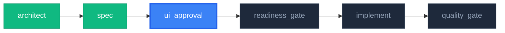

# UI Approval Gate

> **Core Principle**: "Visual Confirmation Prior to Implementation" — Verify and approve UI before writing code to prevent costly rework.

A quality gate that generates wireframes based on SPEC and Screen documents, permitting advancement to implementation only after approval — by the user for structural (one-way) UI changes, automatically for in-structure changes that passed an independent critique.

## Core Principles

1. **Guaranteed Visual Verification**: UI wireframes must be verified before writing code.
2. **Risk-Tiered Approval**: The approval policy decides who approves (Phase 4.0). Structural changes — navigation, design system, removed screens, many existing screens — always go to the user; nothing the AI declares can skip that.
3. **Revision Limit**: Enforce a hard decision after a maximum of 3 revisions.
4. **Multi-layer Representation**: SVG diagrams + Mermaid flowcharts + ASCII UI layouts.
5. **Mandatory for All Features**: Runs in every pipeline without exception (skipping prohibited).
6. **Before/After Comparison**: Explicitly display diffs against current state during `MODIFY_FEATURE`.

---

## Workflow

```
+-------------------------------------------------------------+
|                    UI Approval Gate                         |
+-------------------------------------------------------------+
|                                                             |
|  Phase 1: Information Gathering & Context Understanding     |
|  +-- Load CONTEXT.json                                      |
|  +-- Load SPEC.md                                           |
|  +-- Load screens/*.md                                      |
|  +-- [MODIFY] Read existing UI code (to construct Before)   |
|                                                             |
|  Phase 2: Pipeline Progress Visualization                   |
|  +-- Display current pipeline phase with SVG/Mermaid        |
|  +-- Color-code Completed / Current / Pending stages        |
|                                                             |
|  Phase 3: Wireframe Generation                              |
|  +-- User flow chart (screen transitions)                   |
|  +-- ASCII UI: Layout for each screen                       |
|  +-- [MODIFY] Before/After comparison layout                |
|  +-- State variations: Loading / Error / Empty states       |
|                                                             |
|  Phase 4: User Review Presentation                          |
|  +-- Present: "Changes will be applied as follows. Approve?"|
|  +-- Prompt for 3-way choice: Approve / Revise / Reject     |
|                                                             |
|  Phase 5: Result Processing                                 |
|  +-- Approve → Update CONTEXT.json + proceed to next stage  |
|  +-- Revise  → Apply feedback + re-run Phase 3 (max 3 times)|
|  +-- Reject  → Offer fallback routing (SPEC/Design rewrite) |
|                                                             |
+-------------------------------------------------------------+
```

---

## Protocol

### Phase 1: Information Gathering

```markdown
## Information Gathering

1. Check CONTEXT.json
   - docs/features/<feature-id>/CONTEXT.json
   - Check current_state, why, success_criteria
   - Determine work_type (NEW_FEATURE / MODIFY_FEATURE)

2. Check SPEC.md
   - docs/features/<feature-id>/SPEC-*.md
   - Inspect FR list and screen requirements

3. Check Screen Documents
   - docs/features/<feature-id>/screens/*.md
   - Inspect per-screen layouts and element definitions

4. [MODIFY_FEATURE only] Read Existing UI
   - Read component code in src/features/<feature-name>/components/
   - Analyze current screen structure to build Before layout
```

### Phase 2: Pipeline Progress Visualization

**Purpose**: Enable users to grasp "what stage we are currently in and what happens next" at a single glance.

Display overall pipeline progress using Mermaid text + ASCII fallback diagrams.

**Progress Diagram Format**:



**Output Template**:

```markdown
## Pipeline Progress

> **Pipeline**: {NEW_FEATURE | MODIFY_FEATURE}

{Mermaid/SVG Diagram}

|     Phase       |  Status  |         Skill          |
| :-------------: | :------: | :--------------------: |
|    architect    |   Done   |   feature-architect    |
|      spec       |   Done   | feature-spec-generator |
| **ui_approval** | **Current** | **ui-approval-gate** |
| readiness_gate  | Pending  |       (Built-in)       |
|    implement    | Pending  |  feature-implementer   |
|  quality_gate   | Pending  |    pre-quality-gate    |
```

### Phase 3: Wireframe Generation

The AI directly generates wireframes based on SPEC and Screen documents.

#### 3A: User Flow Diagram

Generates screen transitions using **Mermaid flowchart** text syntax.
Actual rendering of SVG/PNG files is handled externally if needed (see "Diagram Output Format" below).

```markdown
### User Flowchart

{Mermaid flowchart diagram}
```

**Generation Rules**:

| Element            | Representation                   |
| :----------------- | :------------------------------- |
| Screen             | Rounded box `["Screen Name"]`    |
| User Action        | Arrow label `--\|Action\|-->`    |
| Decision Point     | Diamond `{"Condition"}`          |
| External API Call  | Parallelogram `[/"API Name"/]`   |
| State Change       | Circle `(("State"))`             |

#### 3B: ASCII UI Layout

Represents the structure of each screen in ASCII art conforming to the Terminal Noir design system.

**Layout Rules**:

| Element          | ASCII Representation          | Tailwind Reference Classes                                      |
| :--------------- | :---------------------------- | :-------------------------------------------------------------- |
| Panel            | `┌─ glass-panel ─┐ ... └───┘` | `backdrop-blur-xl bg-white/5 border border-white/10 rounded-xl` |
| Button           | `[Button Name]`               | `bg-blue-600 hover:bg-blue-700 rounded-lg`                      |
| Input Field      | `[______Input______]`         | `bg-black/40 font-mono border-l-2 border-blue-500`              |
| Icon             | `[Icon]`                      | Lucide/Heroicons SVG                                            |
| Tab              | `[Tab1] [Tab2] [Tab3]`        | `border-b-2 border-blue-500`                                    |
| Progress Bar     | `████████░░░░ 67%`            | `bg-blue-600 rounded-full`                                      |

**State Variations** (Present the following for each screen):

| State                         | Requirement                              |
| :---------------------------- | :--------------------------------------: |
| Normal View (with data)       | Required                                 |
| Loading State                 | Required                                 |
| Empty State (no data)         | Required                                 |
| Error State                   | Optional (when error-handling FR exists) |

#### 3C: Before/After Comparison (MODIFY_FEATURE only)

When modifying existing features, display the **Current UI** and **Updated UI** side by side.

**Comparison Template**:

```markdown
### UI Change Comparison: {screen_name}

#### Before (Current)

{ASCII UI: Current layout parsed from existing code}

#### After (Proposed)

{ASCII UI: New layout reflecting SPEC changes}

#### Change Summary

| Location        | Before         | After                 | Rationale             |
| :-------------- | :------------- | :-------------------- | :-------------------- |
| Header          | Text only      | Icon + Text           | Improved legibility   |
| Card layout     | 1 column       | 2-column grid         | Higher info density   |
| Newly added     | -              | Export button         | Supports FR-00103     |
```

**Before Layout Rules**:

| Condition                          | How to Construct Before Layout                                    |
| :--------------------------------- | :---------------------------------------------------------------- |
| Existing component code available  | Generate ASCII UI from code in `src/features/<name>/components/`  |
| No component (new screen added)    | State "None (New Screen)" in Before; display After only           |
| Existing wireframe available       | Use `docs/wireframes/feature-<id>-wireframe.md` as Before         |

### Phase 4.0: Approval Tier (Who Approves)

1. **Independent critique** — a reviewer that did not draw the wireframes (a subagent given only the SPEC and the wireframes) checks them against the SPEC: every FR and screen has a layout, Normal / Loading / Empty states exist, design-system tokens only, Before/After present for `MODIFY_FEATURE`. Result: `pass` or `fail` with the misses.
2. **Decide** from the wireframes' facts, not from confidence:

```bash
node .claude/scripts/approval-policy.mjs decide --surface ui --signals-json \
  '{"navigation_changed":false,"design_system_changed":false,"screens_removed":0,"screens_new":1,"existing_screens_changed":0,"automated_critique":"pass"}'
```

- **exit 3 (T2)** or the script missing / erroring → Phase 4 explicit approval flow.
- **exit 0 (T1)** → approve automatically: record it as below, show the wireframes with `Auto-approved (T1: <reasons>) — say "revise" to reopen`, and continue. A later "revise" from the user reopens the gate as a normal revision.

Why: approving every screen by hand trains the user to click through (Claude Code measured 93% prompt acceptance); the attention belongs on changes users cannot un-learn. Policy SSOT: `.claude/config/approval-policy.json#ui`.

### Phase 4: User Review Presentation

Presents generated wireframes to the user via an **explicit approval flow** (T2, per Phase 4.0).

**Key Presentation Format** (Common across NEW_FEATURE / MODIFY_FEATURE):
- Header: `# This will be {implemented|modified} as follows. Do you approve?` + Feature ID + Work Type + Revision Count
- Body: Pipeline Progress → User Flow → (NEW: Screen Layouts + State Variations / MODIFY: Before/After Comparison + Impact Summary)
- Footer: 3-way choice: Approve / Request Revision (stating remaining revisions) / Reject

> Complete NEW_FEATURE + MODIFY_FEATURE review templates: [review-templates.md](references/review-templates.md)

**HTML Deck Elevation (Conditional Promotion — R-CM-028 Code Branch)**: If `.claude/scripts/review-deck.mjs` exists in the repository, elevate the presentation to a CP-UI HTML deck:

```bash
node .claude/scripts/review-deck.mjs --stage ui --wireframe docs/wireframes/feature-<id>-wireframe.md \
  --narrative-json <path> [--feature <id>]
# Open output index.html. Feedback loop (optional): reuse ship-deck-bridge
```

Chat presentation (pipeline progress + 3-way choice) is preserved. **The Approve/Revise/Reject gate logic and CONTEXT.json state machine remain immutable** — the deck is merely a presentation format, not the verdict engine. If the script is absent (such as initial scaffold deployment), SKIP elevation and use chat presentation only.

### Phase 5: Result Processing

Process according to 3-way branching:

| Outcome | Core Action | CONTEXT.json Update | Next Stage |
| :--- | :--- | :--- | :--- |
| **Approve** | Finalize wireframe storage + record history | `ui_approval.status="approved"`, `approved_at`, `revision_count` | feature-pilot Go signal (proceed to implementation) |
| **Revise** | revision_count < 3 → return to Phase 3 / >= 3 → demand hard decision | Append feedback to `revisions[]` | Re-run Phase 4 |
| **Reject** | Present explicit fallback routing options and record reason | `status="rejected"`, `rejected_reason`, `current_state="Blocked"` | Route based on user selection:<br>1) `feature-spec-updater`: Fundamental SPEC/FR overhaul<br>2) `design-pilot`: Design system/theme redesign<br>3) Immediate restart: Regenerate wireframes from scratch reflecting feedback |

> Detailed processing procedures / Hard decision (after 3 revisions) templates: [review-templates.md](references/review-templates.md), [state-management.md](references/state-management.md)

---

## Diagram Output Format

The primary artifact of this skill is a **text diagram** — neither this repo nor standard skills include a built-in Mermaid → SVG renderer, so assuming rendering would create a dead branch.

1. **Mermaid Text Blocks** (Default): Output Mermaid syntax inside code blocks. Standard markdown viewers (GitHub, VS Code, etc.) render them automatically.
2. **ASCII Flowcharts** (For viewers lacking Mermaid support): Text arrows showing screen transitions.

**File Naming Convention** (When SVGs are separately rendered via external tools):

```
docs/wireframes/
├── feature-{id}-wireframe.md        # Wireframe document (includes Mermaid text)
├── feature-{id}-flow.svg            # User flow SVG (if externally rendered)
└── feature-{id}-pipeline.svg        # Pipeline progress SVG (if externally rendered)
```

**ASCII Example**:

```
[Code Input] ──→ [Analyzing...] ──→ [Display Results]
                                       ├──→ [Explanation Panel]
                                       ├──→ [Diff View]
                                       └──→ [Quiz]
```

---

## CONTEXT.json Schema & State Machine

`ui-approval-gate` adds/updates the `ui_approval` section in `CONTEXT.json` and introduces the `UiApproval` state to the feature-pilot state machine.

**Core Fields** (`ui_approval`):
- `status`: `pending | in_review | approved | rejected`
- `wireframe_path`, `svg_paths.{flow,pipeline}` (paths to generated artifacts)
- `work_type`: `NEW_FEATURE | MODIFY_FEATURE`
- `revision_count` (≤3), `revisions[]` (feedback history), `approved_at`, `rejected_reason`

**State Machine Transitions**: `SpecDrafting/SpecUpdating → UiApproval → Implementing` (on Approve) / `→ Blocked` (on Reject) / `→ UiApproval` (upon resolving Blocked).

> Complete JSON schema + State definitions + Transition rules: [state-management.md](references/state-management.md)

---

## Output Format

3-way result reporting (Approve / Revise / Reject) — Header + Core fields + Next step instructions.

> Full report templates (Approve/Revise/Reject): [review-templates.md](references/review-templates.md)

---

## AI Behavioral Guidelines

### DO

- **Always display pipeline progress diagram first** (clarifying current position)
- Clearly present generated wireframes to the user
- **Run Phase 4.0 before every presentation** and record `approved_by` / `risk_tier`
- **Use the prompt format (T2): "This will be {implemented|modified} as follows. Do you approve?"**
- Require an explicit choice between Approve / Revise / Reject
- Accurately track revision count (maximum 3 revisions)
- Update the `ui_approval` section in `CONTEXT.json`
- Clearly convey Approve/Reject outcomes to feature-pilot
- Produce wireframes conforming to the Terminal Noir design system
- **Always provide Before/After comparisons during `MODIFY_FEATURE`**
- **Output diagrams as Mermaid text blocks** (SVG rendering is external)
- **Present all state variations (Normal / Loading / Empty states)**

### DON'T

- Never auto-pass a T2 change, or a change whose critique did not pass
- Never under-report signals to reach T1 — a removed screen or navigation change declared as `0`/`false` is a forged approval
- Never request approval without presenting wireframes
- Never allow revisions exceeding 3 iterations
- Never halt pipeline without logging rejection reasons
- Never omit `CONTEXT.json` updates
- Never omit pipeline progress visualization — the user approves against where the feature sits in the pipeline
- Never omit Before/After comparisons during `MODIFY_FEATURE` — approval of a modification is a judgment on the delta
- Never skip this gate for any feature — it is the only visual check before code is written

---

## Usage Examples

### Automated invocation from feature-pilot (Recommended)

```bash
# feature-pilot invokes automatically following SPEC generation
# Mandatory across all features
# No direct user invocation required
```

### Direct Invocation (Standalone use)

```bash
# Preview UI for a specific feature in advance
/ui-approval-gate dashboard

# Re-review existing wireframe
/ui-approval-gate dashboard --review
```

---

## References

- [CLAUDE.md Design System](../../../CLAUDE.md) - Terminal Noir theme definition
- `feature-pilot` skill - Pipeline integration
- `feature-spec-generator` skill - Original SPEC generation

---

## Not For / Boundaries

This skill is strictly limited to **UI wireframe generation + user approval gate**. The following are delegated:

| Out of Scope Area                  | Delegation Target                                | Rationale                                              |
| :--------------------------------- | :----------------------------------------------- | :----------------------------------------------------- |
| SPEC authoring / FR definition     | `feature-spec-generator`, `feature-spec-updater` | This skill consumes SPEC inputs, it does not author them|
| Actual UI code implementation      | `feature-implementer`                            | Wireframe = consensus artifact, code = separate stage  |
| Design tokens / color systems      | `design-pilot`, `color-palette`                  | Design system definition belongs to design-pilot SSOT   |
| Frontend polishing / interactions  | `feature-implementer`, `final-review`            | Fine interactions are implementation responsibilities  |
| E2E tests / visual regression      | `e2e-runner`                                     | This skill handles static wireframes only              |
| Mermaid → SVG actual rendering     | (External Mermaid renderer)                      | This skill outputs Mermaid text only                   |
| Production UI code review          | `design-pilot --review-only`, `final-review`     | Post-implementation review is a separate gate          |
| A/B testing / user metrics         | `metrics-designer`                               | Hypothesis validation belongs to metrics design        |

This skill only manages up to the **persistence of the Approve/Reject decision**. Subsequent steps are the responsibility of the delegated skills.

---

## Maintenance

- **Sources**: brief2dev internals (`.claude/rules/` R-CM/R-PL rules + `.claude/skills/` skill conventions). External references in body.
- **Last updated**: 2026-07-14
- **Known limits**: Wireframe generation and approval gate only. Actual implementation/design tokens/E2E testing belong to delegated skills above.
- **References**: [review-templates.md](references/review-templates.md), [state-management.md](references/state-management.md)
