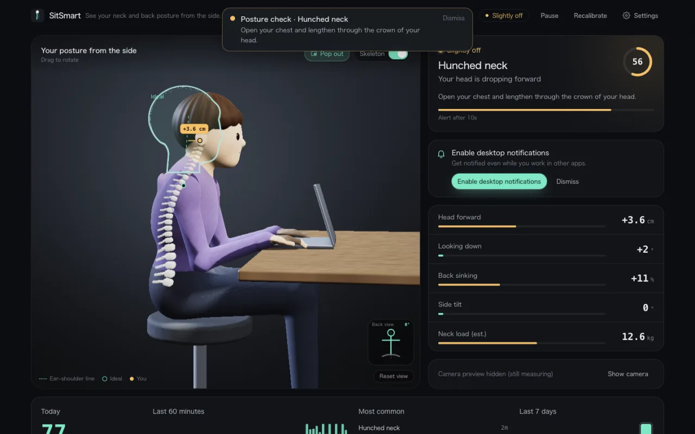
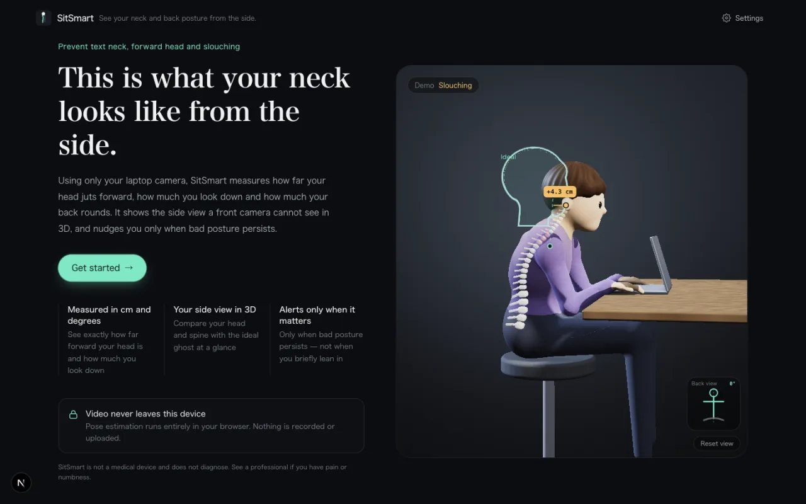
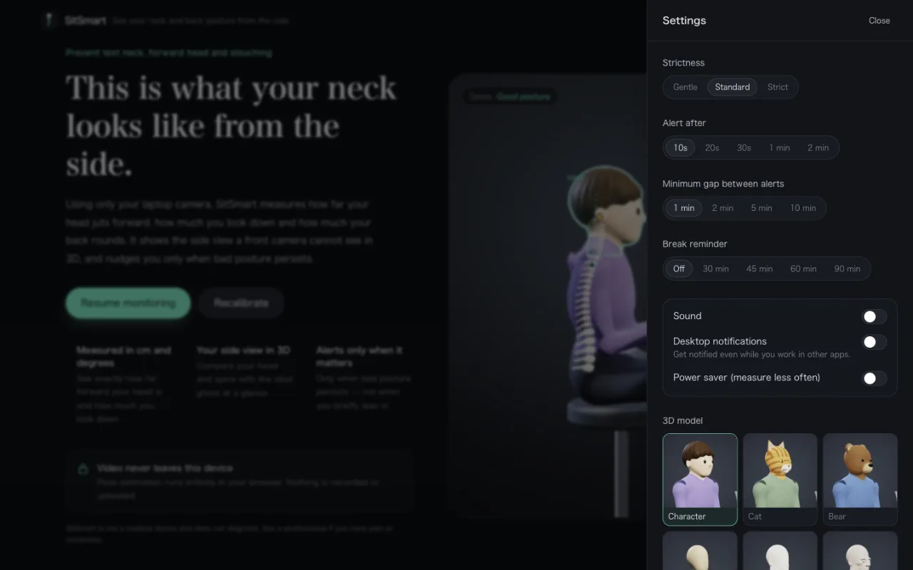
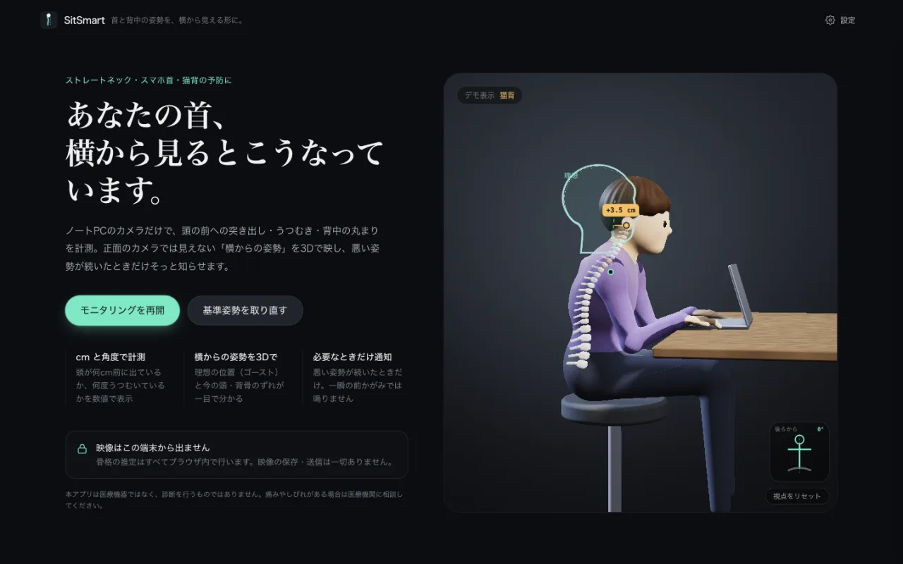
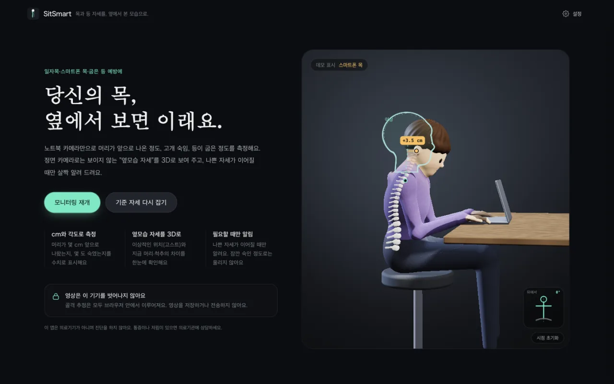

# SitRight

**English** | [日本語](README.ja.md) | [한국어](README.ko.md)

SitRight uses nothing but your laptop webcam to measure **forward head, text neck, hunched neck and slouching**.
It shows the side view of your posture that a front-facing camera cannot see, in 3D, and nudges you only when bad posture persists.
Video never leaves your browser: pose estimation runs locally with MediaPipe.

**Try it:** https://sitright.pages.dev

> SitRight is not a medical device and does not diagnose anything.



| Welcome | Settings |
| --- | --- |
|  |  |

The UI is available in English, Japanese and Korean (picked from your browser language; change it in Settings).

| 日本語 | 한국어 |
| --- | --- |
|  |  |

## How it works

1. **Camera check** — guides you until your face, both shoulders and a frontal view are visible
2. **Baseline (3 s)** — you hold a good posture; the median becomes *your* baseline
3. **Monitoring** — shows the deviation from your baseline in cm and degrees, and alerts you when it lasts longer than the configured delay (20 s by default)

Each camera frame is reduced to the following measurements (`src/core/metrics.ts`) and compared with your baseline (`src/core/assessment.ts`).

| Measurement | How it is computed | Mainly indicates |
| --- | --- | --- |
| Head forward (cm) | From the change in the face-width / shoulder-width ratio and the head distance D from the facial transformation matrix: `D·(1 − r0/r)` | Forward head, hunched neck |
| Looking down (°) | Pitch of the facial transformation matrix | Text neck |
| Back sinking (%) | Shrinking of the shoulder-to-ear height relative to shoulder width (corrected for looking down) plus shoulder drop | Slouching, hunched neck |
| Side tilt (°) | Angle of the shoulder line | Leaning |

- Ratios do not change when your whole body moves closer, so **leaning towards the screen alone is not flagged**
- Unreliable frames (shoulders out of view, head turned, body at an angle) are ignored
- Alerts use a decaying accumulator, hysteresis and a cooldown so that a brief lean does not trigger them (`src/core/alerts.ts`)
- Neck load (kg) is an estimate interpolated from the neck flexion angle using Hansraj (2014)

## Privacy and security

- All processing happens in the browser. Nothing is recorded or uploaded; settings, baseline and daily stats stay in `localStorage`.
- The production build is a static export served with a strict Content Security Policy (`connect-src 'self'`, hashed inline scripts, `frame-ancestors 'none'`) plus HSTS, `Permissions-Policy`, `Referrer-Policy: no-referrer` and COOP (`scripts/postbuild.mjs` writes `out/_headers`).
  MediaPipe 1.x sends usage telemetry to Google every 60 s; the CSP blocks it, and the E2E test asserts that no request leaves the origin.
- After the page has loaded, monitoring keeps working without a network connection (covered by `tests/e2e/offline.spec.ts`).
- CI runs CodeQL, gitleaks (secret scanning), dependency review and `npm audit`; Dependabot keeps dependencies and pinned GitHub Actions up to date.
- The app needs no API keys or secrets.

See [SECURITY.md](SECURITY.md) to report a vulnerability.

## Project layout

```
src/
  core/        posture logic (pure functions, unit tested)
  engine/      MediaPipe, camera, notifications and the main loop (controller.ts)
  stores/      Zustand (settings, baseline and daily stats persisted to localStorage)
  components/  screens (Welcome / Setup / Calibrate / Monitor) and the 3D scene
    PostureScene/  SDF ray-marched body, spine (X-ray view) and ideal-posture ghost
  i18n/        UI strings (en, ja, ko)
```

## Development

Requires Node.js 22.

```bash
npm install
npm run dev          # http://localhost:3000
npm test             # unit tests (Vitest)
npm run lint && npm run type-check
npm run build        # static export to out/ (with _headers)
npm run preview      # serve out/ with Cloudflare Pages locally (http://localhost:3011)
```

- The MediaPipe wasm files are copied from `node_modules` into `public/mediapipe/wasm` before `dev` and `build`. The models live in `public/mediapipe/models`.
- `/lab?f=6&p=10&s=20` shows the 3D scene on its own (development only).
- To use a recorded video instead of the camera, generate one with `tests/e2e/fixtures/generate.sh` and open `/?source=/dev/posture.mp4` on the dev server (development only).
- E2E: run `tests/e2e/fixtures/generate.sh`, then `npm run test:e2e`. Playwright builds the app and starts Chromium with a fake camera.
- Background tabs: with `node tests/e2e/serve-out.mjs 3011` running, `node tests/e2e/background-check.mjs [seconds]` records a baseline with the fake camera, moves another tab to the front and reports measured time, alerts and CPU usage while hidden.

## Deployment

`main` is deployed to Cloudflare Pages:

```bash
npx wrangler login
npm run deploy       # build + wrangler pages deploy out --project-name sitright --branch main
```

## Browser support

Latest Chrome, Edge, Safari and Firefox (WebGL2 required). Desktop notifications need browser permission.
When the tab is in the background, measuring continues using a Worker timer and frames grabbed directly from the camera track (Chrome's ImageCapture).
With a fake camera in headless Chromium, 180 s of hidden time produced 180 s of measurements and alerts, at about a quarter of the visible CPU usage
(long sessions with a real camera, and hidden tabs in Safari and Firefox, which lack ImageCapture, are not yet verified).

Install it from the browser menu ("Install app", PWA) to keep it in its own window.

## License

MIT ([LICENSE](LICENSE)). The bundled MediaPipe wasm and models are Apache-2.0 ([THIRD_PARTY_NOTICES](THIRD_PARTY_NOTICES)).
